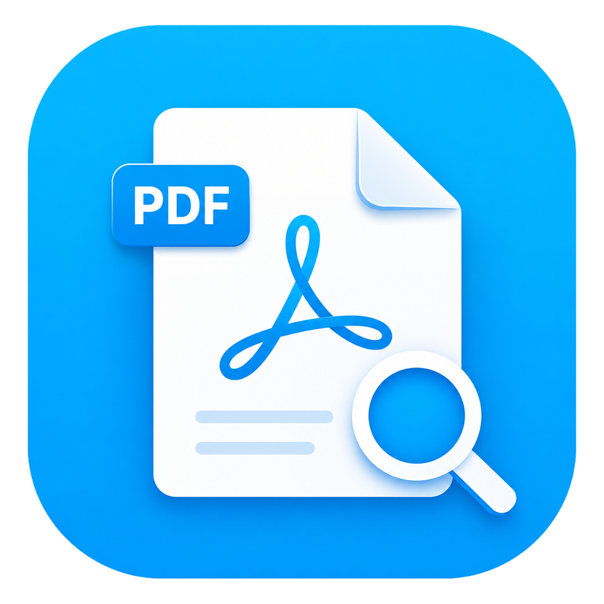

<p align="center">
  
</p>

<h1 align="center">MyPDF</h1>

<p align="center">
  面向 Android 的本地 PDF 阅读、搜索、批注与处理工具
</p>

<p align="center">
  
  
  
  
</p>

---

## 项目简介

MyPDF 是一款以本地处理为核心的 Android PDF 工具，提供 PDF 阅读、文本层与 OCR 搜索、批注、文本复制、PDF 创建与转换、页面管理、安全保护等功能。

PDF 阅读、搜索、OCR、批注、创建、转换、页面管理和安全设置均在设备本地执行。应用不会为了核心功能上传 PDF 文件、页面图像、正文、OCR 结果、搜索词、批注内容、密码、文件名、路径、URI 或 PDF 元数据。

---

### 技术支持

本项目的核心搜索与解析能力由开源引擎 [android-pdf-search-engine](https://github.com/g-o-d-v/android-pdf-search-engine) 提供底层支持。

## 下载与安装

前往本仓库的 **[下载最新版本](../../releases/latest)** 页面下载最新 APK。

> 首次公开版本仍处于持续验证阶段。重要文档请保留原始副本，不建议仅依赖单一设备中的文件。

---

## 主要功能

### 阅读与基础操作

- PDF 阅读与页面浏览；
- 文本层长按选择和复制；
- 文件收藏；
- 文件详情查看；
- 支持较长页面和长图类文档；
- 搜索、工具与阅读界面相互独立。

### PDF 搜索

支持文本层搜索与 OCR 搜索：

- 智能搜索：优先文本层，按需继续 OCR；
- 仅文本搜索；
- 仅扫描页 OCR；
- 区分大小写；
- 跨行匹配；
- 忽略空白字符；
- 合并英文断行连字符；
- 仅匹配完整单词；
- OCR `O/o/0` 易混淆容错；
- 优先搜索当前阅读页；
- 960 / 1280 / 1440 三档 OCR 识别精度；
- 搜索缓存清理。

OCR 搜索依赖设备性能。页面数量较多、图片分辨率较高或扫描质量较差时，处理时间会明显增加。

### 批注

- 自由涂鸦；
- 箭头；
- 文字注释；
- 覆盖保存；
- 另存副本；
- 根据 PDF 权限限制阻止不允许的保存操作。

当前批注不支持跨页连续绘制。线条、箭头或文字跨越分页边界时可能被截断。

### 创建 PDF

- 多张图片转 PDF；
- 长图转 PDF；
- 文本转 PDF；
- 创建空白 PDF；
- 自动排除不支持的图片格式。

支持的常见图片格式包括 JPG、JPEG、PNG 和 WebP。

### 导出与转换

- PDF 页面导出为图片；
- 页面导出为长图；
- 导出 PDF 文本；
- 扫描 PDF 添加可搜索文字层；
- 对耗时较长的 OCR 操作提供进度和提示。

### 页面管理

- 页面排序；
- 删除页面；
- 另存所选页面；
- 合并多个 PDF；
- 使用独立进程执行部分高负载 PDF 操作。

### PDF 安全

- 设置打开密码；
- 移除密码；
- 设置复制、批注等权限限制；
- 清除 PDF 元数据；
- 区分用户密码与所有者密码；
- 在 MyPDF 内对受限复制、导出和批注操作进行拦截。

PDF 权限并非绝对 DRM。其他软件是否遵守 PDF 权限取决于其自身实现。

---

## 隐私与诊断

完整说明请查看 **[PRIVACY.md](PRIVACY.md)**。

### 匿名崩溃报告

匿名崩溃报告默认关闭。用户明确开启后，MyPDF 才会通过 Firebase Crashlytics 发送新的 Java、native 崩溃和受支持系统上的部分 ANR 信息。

可能包含：

- 应用版本与构建类型；
- Android 版本；
- 设备厂商、型号与 ABI；
- 崩溃堆栈和 native 崩溃所需信息；
- 白名单中的粗粒度功能状态。

不会主动包含：

- PDF 文件、文件名、路径或 URI；
- PDF 正文和元数据；
- OCR 结果和搜索词；
- 批注内容和密码；
- 页面截图；
- Android ID、广告 ID、IMEI；
- 联系人、应用列表或 Logcat。

用户可以在设置页关闭匿名崩溃报告，并请求删除设备上尚未发送的报告。

### 应用内反馈

应用内反馈通过 FormSubmit 的 HTTPS 接口转发给开发者。

用户主动提交时可填写：

- 问题类型；
- 问题描述；
- 复现步骤；
- 可选联系邮箱。

应用会自动附带：

- MyPDF 版本；
- Debug / Release 构建类型；
- Android 版本和 API；
- 设备厂商与型号；
- ABI；
- 系统语言；
- 匿名崩溃报告开关状态；
- 本地生成的反馈编号。

反馈提交不会附带 PDF、文档内容、搜索词、OCR 结果、批注、密码或截图。

---

## 问题反馈

### GitHub Issues

适合：

- 可以公开讨论的问题；
- 可稳定复现的 Bug；
- 功能建议；
- 需要长期跟踪的事项。

提交 Issue 时建议包含：

1. MyPDF 版本；
2. Android 版本；
3. 手机厂商和型号；
4. 问题发生前的操作步骤；
5. 实际结果与期望结果；
6. 是否可以稳定复现。

请勿上传包含隐私内容的 PDF、截图、文件名、路径、密码或个人信息。

### 应用内反馈

进入：

```text
设置 → 帮助与反馈 → 应用内反馈
```

填写表单后直接提交。反馈成功后会生成一个本地反馈编号，可用于后续补充说明。

### 公开联系邮箱

```text
3472966871@qq.com
```

---

## 从源码构建

### 环境

建议使用：

- Android Studio；
- JDK 17；
- Android SDK 34；
- 与项目配置匹配的 Gradle、Android Gradle Plugin 和 NDK；
- 支持访问 Google Maven、JitPack 和项目依赖源的网络环境。

### Firebase 本地配置

公开仓库不应提交生产环境的：

```text
app/google-services.json
```

本地构建 Crashlytics 功能时，需要：

1. 在自己的 Firebase 项目中注册 Android 应用；
2. 使用与本地工程一致的 `applicationId`；
3. 下载 `google-services.json`；
4. 放入 `app/` 目录；
5. 确认该文件已被 `.gitignore` 排除。

### 构建命令

Windows：

```powershell
.\gradlew.bat :app:assembleDebug
```

Release 构建前，请自行配置正式签名，不要将签名文件、密码或生产 Firebase 配置提交到公开仓库。

---

## 项目结构

主要代码位于：

```text
app/src/main/java/com/nless/mypdf/
├─ app/            应用初始化
├─ core/           核心配置与通用逻辑
├─ data/           本地数据
├─ diagnostics/    崩溃诊断上下文
├─ feature/        PDF 创建、转换、管理、安全、反馈等功能
└─ ui/             首页、阅读器、设置页和通用界面
```

---

## 当前限制

- 当前主要面向 `arm64-v8a` 设备；
- OCR、添加文字层、合并大型 PDF 等操作可能耗时较长；
- 极大 PDF、异常 PDF 或内存紧张设备仍可能出现崩溃或系统终止进程；
- 批注不支持跨页连续绘制；
- native 崩溃堆栈的完整符号化取决于相应二进制符号是否可用；
- 应用内反馈依赖第三方 FormSubmit 服务及用户当前网络环境；
- 公开初始版本尚未经过大规模设备矩阵和长期线上数据验证。

---

## 参与贡献

欢迎通过 Issue 提交 Bug、建议和可复现案例，也欢迎提交 Pull Request。

贡献前请注意：

- 不要提交签名文件、密码、令牌或私人邮箱配置；
- 不要上传真实用户 PDF 或其他隐私数据；
- 尽量让提交保持单一目的；
- 涉及功能行为变化时，请同步更新相关说明和测试步骤。

---

## 赞助

MyPDF 基础版可以免费下载和使用。赞助不是获得功能、技术支持或优先处理 Issue 的必要条件，但可以帮助承担测试设备、网络服务和持续维护成本。

<table>
  <tr>
    <td align="center"><strong>微信</strong></td>
    <td align="center"><strong>支付宝</strong></td>
  </tr>
  <tr>
    <td></td>
    <td></td>
  </tr>
</table>

感谢每一位测试、反馈、贡献和支持 MyPDF 的用户。

---

## 许可证

MyPDF 基础版采用 [Apache License 2.0](LICENSE) 开源。

---

## 免责声明

MyPDF 按现状提供，不保证适用于所有 PDF、所有设备或所有使用场景。

涉及合同、证件、财务资料、研究数据或其他重要文档时，请始终保留原始文件和独立备份。进行加密、解密、页面删除、覆盖保存、批注保存、合并或格式转换前，建议先另存副本。
